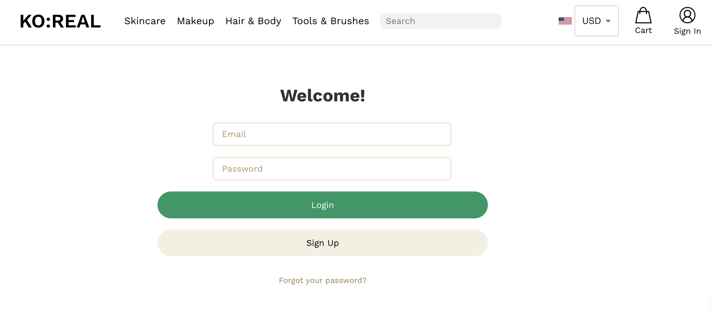
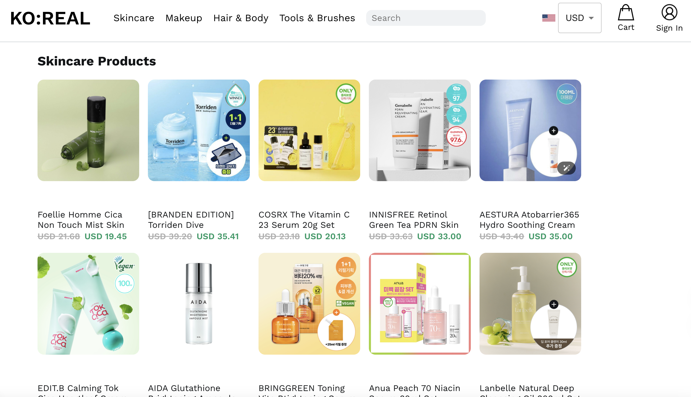

## KO:REAL
### 2024 Fintech Internship Course
해외에서 자국의 통화로 환전송금이 한번에 되는 쇼핑몰

### 1. 프로젝트 기획 배경
---

  
  

### 2. 프로젝트 주요 화면
---

|회원가입 및 로그인|홈 화면|카테고리 화면|
|------|---|---|
|  |  |  |

|통화 단위 변환|상품 상세 페이지|
|------|---|
|  |  |

|주문하기|결제하기|
|------|---|
|  |  |

[시연 영상 보러가기](https://youtu.be/j5-hajIbG-s?si=qDfm5h8BruJBoV1U)

### 3. 파트 분담

|홈화면 @yeriel03|홍서정 @zczl929|이예린 @dpfls0922|
|------|---|---|
|  |  |  |
|FRONTEND|FRONTEND|BACKEND|
|- 미니 장바구니 페이지   - 상단 바 네비게이션 | - 회원 관리 페이지   - 상품 관련 페이지   - 장바구니 페이지   - 결제 페이지   - 프론트엔드 및 백엔드 연동 |- 스프링 시큐리티를 활용한 회원가입 및 로그인   - 회원 관리 API   - 상품 관련 API   - 외부 환율 정보 조회    - 통화 단위 변환 API   - 해외송금 API   - 상품 검색 페이지   - 프론트엔드 및 백엔드 연동 |